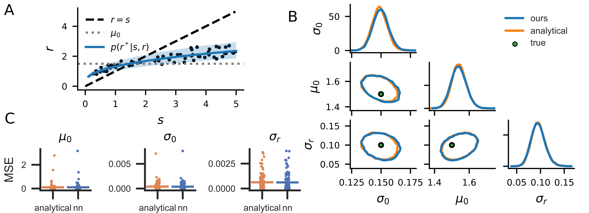

# Inverse decision-making using neural amortized Bayesian actors
(anonymous ICLR 2025 submission)

## Requirements

To install requirements:

```
python -m pip install -r requirements.txt
```

## Training

To generate an evaluation dataset used during training, run:

```
python generate_eval_data.py --cost <cost_function_name>
```

To train an action network, run this command:

```
python train.py --cost <cost_function_name>
```

As of now, the following cost functions are available: `QuadraticCost`, `QuadraticCostQuadraticEffort`, `AsymmetricQuadratic`, `Linex`, `AbsoluteCost`, `AbsoluteCostQuadraticEffort`, `InvertedGaussian`

## Inference

To run inference on a simulated dataset, run:

```
python run_inference.py --cost <cost_function_name>
```

## Disentangling priors and costs

To run the script that disentangles prior and costs using multiple levels of perceptual uncertainty, run:

```
python disentangling.py
```

## Results

